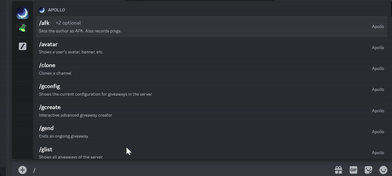
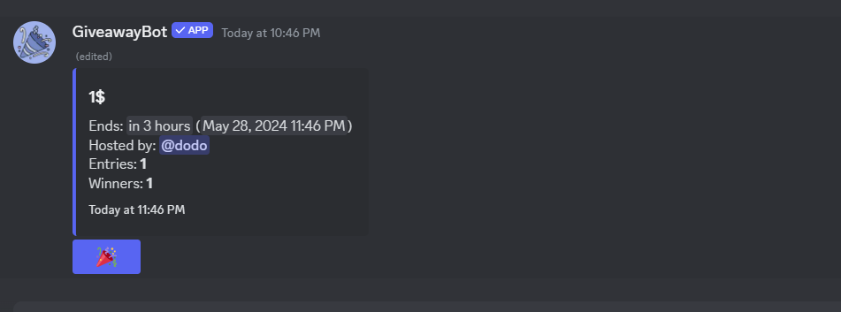
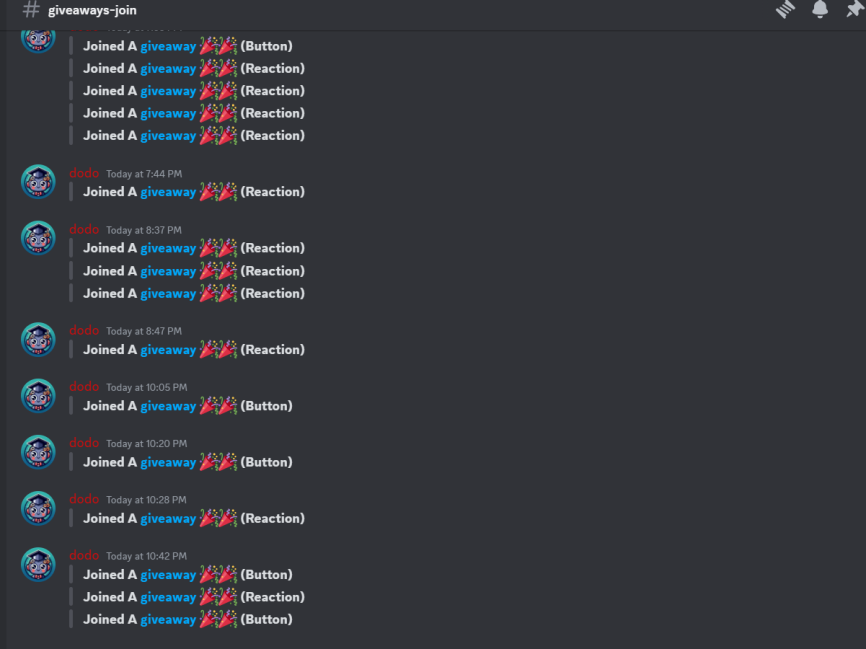

# giveaway-scanner
Automatic participation in giveaway (discord-self)





# Before Start
<h3 style="color: red;">
Using self-bots on Discord is against the platform's terms of service. Self-bots are automated accounts that run user-side scripts to perform actions on Discord without human interaction. This practice violates Discord's policies because it can lead to spam, harassment, and other disruptive behaviors, undermining the community's safety and integrity. Users caught employing self-bots risk account suspension or permanent bans from the platform. For a safe and enjoyable experience, it is crucial to follow Discord's rules and guidelines.
</h3>

<hr />

## Supports 
```diff
+ reaction
+ buttons
+ ^100 giveaway Bot
```

# Getting Started

> Token
```diff
+ You Need Only One Discord Account Self Token Foreach Project
```
<hr />

> env File
```diff
+ Create .env file
+ But your token TOKEN="YOUR_TOKEN"
```
<hr />

> Installing & Running
```
npm i & node index.js
```
<hr />

### What Ever You May Get Banned By Discord